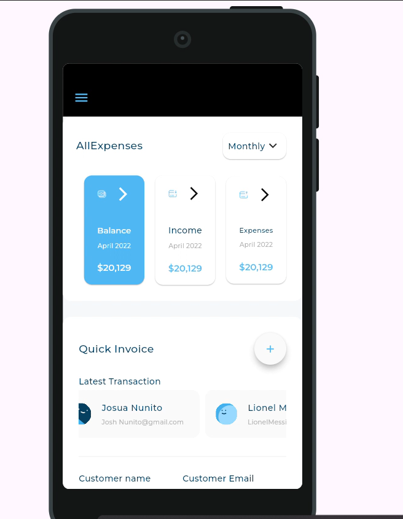
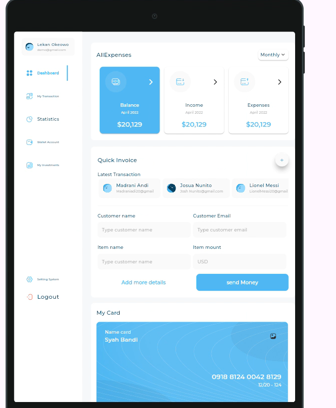
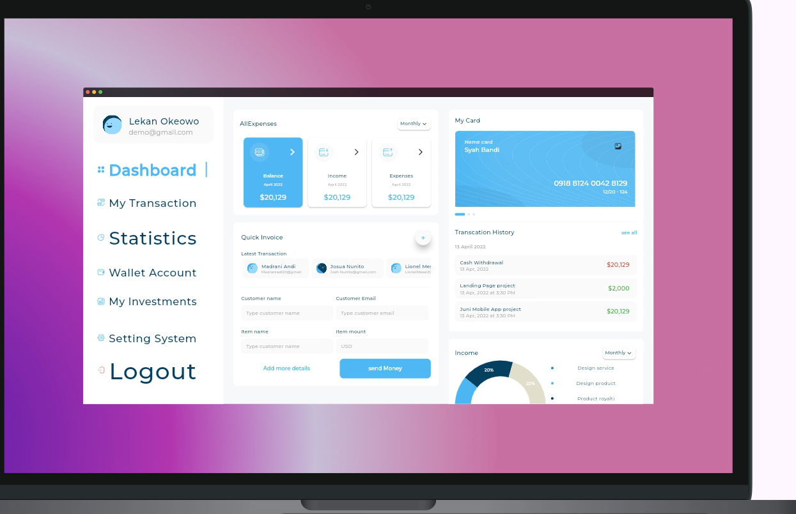

# 🖥️ Admin Dashboard — Responsive & Adaptive Flutter UI

> A fully responsive and adaptive admin dashboard built with Flutter.  
> Adapts seamlessly across **Mobile, Tablet, Web, and Desktop** from a single codebase.

---

## 📱 Screenshots

| iPhone | Tablet |
|:------:|:------:|
|  |  |

| Web | Desktop |
|:---:|:-------:|
|  |  |

---

## ✨ Features

- 📐 **Fully Responsive** — adapts to any screen size automatically
- 🖥️ **4 Platform Support** — Mobile, Tablet, Web, Desktop
- 📊 **Charts & Analytics** — interactive charts via fl_chart
- 📄 **Expandable Page View** — smooth content navigation
- 🎨 **Custom Font** — Montserrat for clean professional look
- 🔍 **Device Preview** — tested across all screen sizes with device_preview

---

## 🏗️ Responsive Strategy

```
Screen Width < 600px   → Mobile layout   (single column)
Screen Width < 900px   → Tablet layout   (two columns)
Screen Width < 1200px  → Web layout      (sidebar + content)
Screen Width >= 1200px → Desktop layout  (full dashboard)
```

### Adaptive vs Responsive

| Concept | Implementation |
|---------|---------------|
| **Responsive** | Fluid layouts that resize with screen width |
| **Adaptive** | Different UI layouts for different device types |

---

## 🛠️ Tech Stack

| Package | Version | Purpose |
|---------|---------|---------|
| `fl_chart` | ^1.1.1 | Charts and data visualization |
| `expandable_page_view` | ^1.0.17 | Smooth expandable page navigation |
| `flutter_svg` | ^2.2.3 | SVG asset rendering |
| `device_preview` | ^1.3.1 | Preview UI on multiple screen sizes |
| `cupertino_icons` | ^1.0.8 | iOS-style icons |

**Font:** Montserrat (Regular + Medium 500)

---

## 🚀 Getting Started

### Prerequisites
```
Flutter SDK >= 3.10.7
Dart SDK ^3.10.7
```

### Installation

```bash
# 1. Clone the repository
git clone https://github.com/AbdelrahmanSiam/admin_dashboard.git

# 2. Navigate to project
cd admin_dashboard

# 3. Install dependencies
flutter pub get

# 4. Run on your target platform

# Mobile
flutter run

# Web
flutter run -d chrome

# Desktop (Windows)
flutter run -d windows

# Desktop (macOS)
flutter run -d macos

# With Device Preview (see all screens at once)
flutter run -d chrome
```

---

## 📁 Project Structure

```
lib/
├── utils/
│   └── app_images.dart      # Generated image assets
├── widgets/                 # Reusable UI components
└── main.dart

assets/
└── images/                  # All image assets

fonts/
├── Montserrat-Regular.ttf
└── Montserrat-Medium.ttf

screenshots/
├── Iphone_view.png
├── tablet_view.png
├── web_view.png
└── desktop_view.png
```

---

## 🎨 UI Highlights

### Device Preview Integration
```dart
// Wrap app with DevicePreview to test all screen sizes
DevicePreview(
  builder: (context) => MyApp(),
)
```

### Responsive Layout Pattern
```dart
// Example of adaptive layout
LayoutBuilder(
  builder: (context, constraints) {
    if (constraints.maxWidth < 600) {
      return MobileLayout();
    } else if (constraints.maxWidth < 900) {
      return TabletLayout();
    } else {
      return DesktopLayout();
    }
  },
)
```

---

## 👨‍💻 Author

**Abdelrahman Siam**  
Flutter Mobile Application Developer

[](https://linkedin.com/in/abdelrahman-siam-2a66072ba)
[](https://github.com/AbdelrahmanSiam)

📧 syamabdo382@gmail.com  
📱 +201282387620
